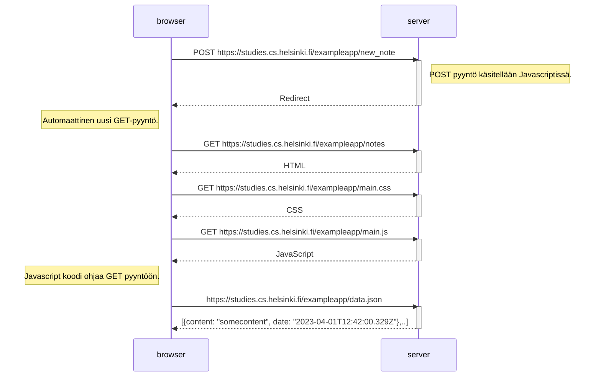

```mermaid
sequenceDiagram
    participant browser
    participant server

    browser->>server:POST https://studies.cs.helsinki.fi/exampleapp/new_note
    activate server
    Note right of server: POST pyyntö käsitellään Javascriptissä.
    server-->>browser:Redirect
    deactivate server
    Note left of browser: Automaattinen uusi GET-pyyntö.

    browser->>server:GET https://studies.cs.helsinki.fi/exampleapp/notes
    activate server
    server-->>browser:HTML
    deactivate server

    browser->>server:GET https://studies.cs.helsinki.fi/exampleapp/main.css
    activate server
    server-->>browser:CSS
    deactivate server

    browser->>server:GET https://studies.cs.helsinki.fi/exampleapp/main.js
    activate server
    server-->>browser:JavaScript
    deactivate server
    Note left of browser: Javascript koodi ohjaa GET pyyntöön.

    browser->>server:https://studies.cs.helsinki.fi/exampleapp/data.json
    activate server
    server-->>browser:[{content: "somecontent", date: "2023-04-01T12:42:00.329Z"},..]
    deactivate server
```
