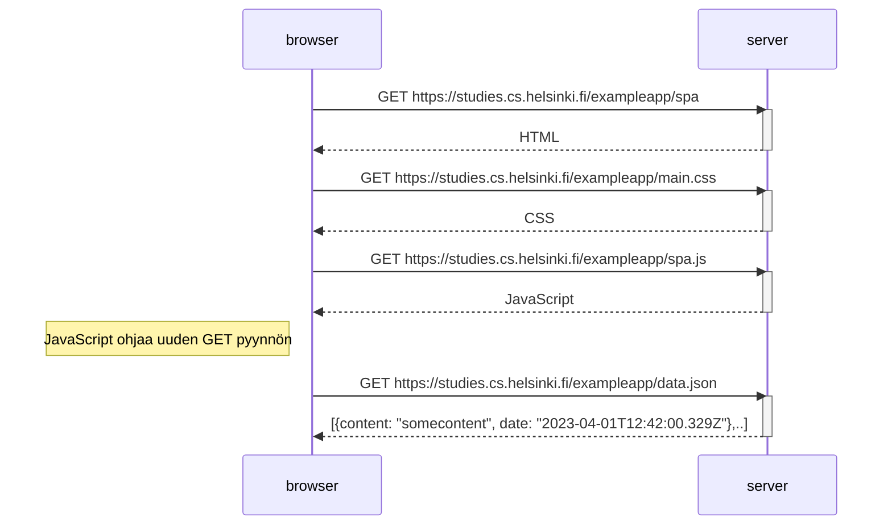

```mermaid
sequenceDiagram
    participant browser
    participant server

    browser->>server:GET https://studies.cs.helsinki.fi/exampleapp/spa;
    activate server
    server-->>browser:HTML
    deactivate server

    browser->>server:GET https://studies.cs.helsinki.fi/exampleapp/main.css;
    activate server
    server-->>browser:CSS
    deactivate server

    browser->>server:GET https://studies.cs.helsinki.fi/exampleapp/spa.js;
    activate server
    server-->>browser:JavaScript
    deactivate server
    Note left of browser: JavaScript ohjaa uuden GET pyynnön

    browser->>server:GET https://studies.cs.helsinki.fi/exampleapp/data.json;
    activate server
    server-->>browser:[{content: "somecontent", date: "2023-04-01T12:42:00.329Z"},..]
    deactivate server
```
